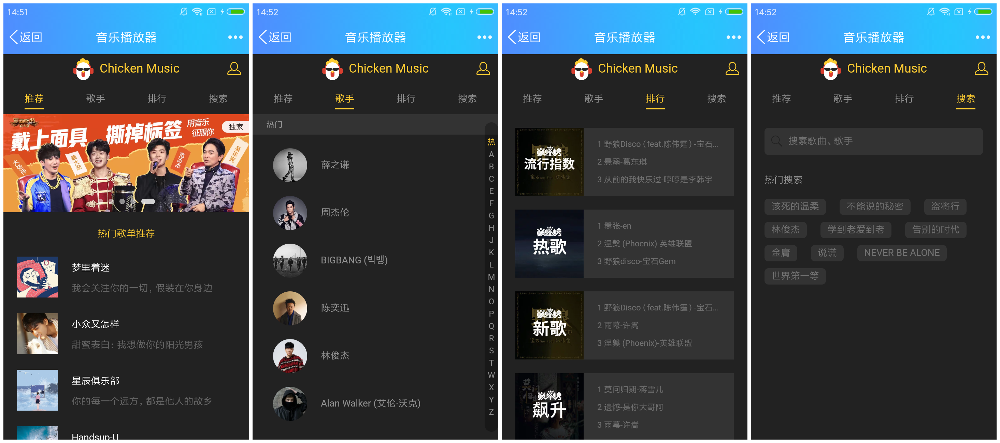
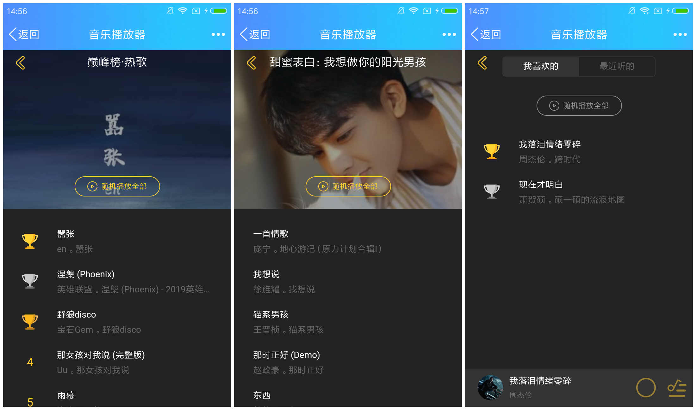
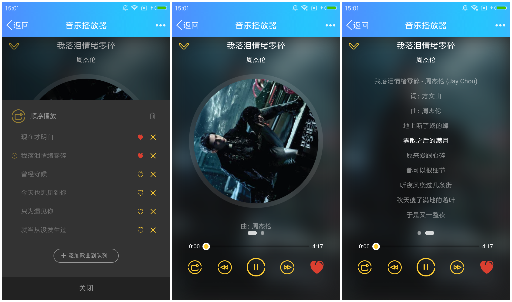

# Vue QQ音乐 WebApp

:musical_keyboard: 基于 Vue(2.5) + vuex + vue-router + vue-axios +better-scroll + Scss + ES6 等开发一款移动端音乐 WebApp，UI 界面参考了安卓版的网易云音乐、flex 布局适配常见移动端。

项目演示地址：[移动端音乐 WebApp](http://101.201.146.64:8181)，或者可以扫描二维码访问：


- 推荐使用手机预览，电脑在 Chrome 调试模式下食用效果更佳，开启调试模式的手机模式后，如果不能滚动，刷新一下页面即可

## 预览

图片虽然压缩过了，但是几张加载一起还是有 3MB 左右，所以请耐心等待一下啦:joy:。感觉不错的可以去上面 :point_up:的地址体验一下呦~

#### 推荐、排行榜、歌手



#### 歌单详情、个人中心



#### 播放器、播放列表



#### 搜索页面


## 开发目的

通过学习开发一个 Vue 全家桶项目，让自己更熟练的使用 Vue 全家桶、模块化开发、ES6 等等知识，提高自己的技术能力。

## 技术栈

**前端**

* `Vue`：用于构建用户界面的 MVVM 框架
* `vue-router`：为单页面应用提供的路由系统，使用了 `Lazy Loading Routes` 技术来实现异步加载优化性能
* `vuex`：Vue 集中状态管理，在多个组件共享某些状态时非常便捷
* `vue-lazyload`：实现图片懒加载，节省用户流量，优化页面加载速度
* `better-scroll`：解决移动端各种滚动场景需求的插件，使移动端滑动体验更加流畅
* `SCSS`：css 预编译处理器
* `ES6`：ECMAScript 新一代语法，模块化、解构赋值、Promise、Class 等方法非常好用

**后端**

* `Node.js`：利用 Express 搭建的本地测试服务器
* `vue-axios`：用来请求后端 API 音乐数据
* `NeteaseCloudMusicApi`：网易云音乐 NodeJS 版 API，提供音乐数据

**其他工具**

* `vue-cli`：Vue 脚手架工具，快速初始化项目代码
* `eslint`：代码风格检查工具，帮助我们规范代码书写（一定要养成良好的代码规范）
* `iconfont` ：阿里巴巴图标库，谁用谁知道
* `fastclick` ：消除 click 移动游览器 300ms 的延

## 实现功能

播放器内核、推荐页面、热榜页面、歌手页面、歌单详情、歌手详情、排行榜详情、搜索页面、播放列表、用户中心等等功能。

### 推荐页面

推荐页分成三个部分，分别是 banner 轮播图、推荐歌单、推荐歌曲，数据都是使用 `axios` 请求 API 获取得到的，图片都使用 `vue-lazyload` 实现懒加载。

轮播图：使用 `better-scroll` 实现，具体可以看这里 [Slide](https://ustbhuangyi.github.io/better-scroll/doc/zh-hans/options-advanced.html#```snap```) 。*点击跳转方面只实现歌曲和歌单的跳转，因为暂时只实现了这两个功能。*

推荐歌单，推荐歌曲：使用 `vuex` 管理数据，方便组件之间的数据交互（播放器播放歌曲）。因为数据上还有播放数量，所以就顺便也加上去了。

### 排行榜页面

同样是通过 API 获取到排行榜的数据，但是因为 API 获取到的是排行榜中所有歌曲的数据，所以难免在加载速度上有点慢，后期再看能不能优化一下，加载的慢毕竟太影响用户体验了，别的就没什么了。

### 歌手页面

实现歌手列表的左右联动（这个需要理解理解），因为之前已经写过和这个有关的博客，所以就不多写了，具体可以看我之前的这个笔记 :arrow_right: [移动端字母索引导航](http://caijin.tech/blog/2018/04/23/2018-4-23-list-view/) 。

### 歌曲列表组件

用来显示歌曲列表，在很多的地方都进行了复用，例如：歌单详情页、排行榜详情页、歌手详情页、搜索结果、用户中心等等。

### 歌单详情页

通过歌单的 ID 来获取歌单中的歌曲数据，然后还做了一些体验上面的交互，比如上滑显示状态栏然后将状态栏标题变为歌单名，具体可以尝试一下就知道了。

然后就是复用 歌曲列表组建 来显示歌曲。

### 排行榜详情、歌手详情

和歌单详情基本上没有什么区别，除了 UI 界面方面有细微的改动（根据不同的内容作出不同的优化）。

### 播放器

最最最重要的组件，毕竟是个音乐播放器，不能放歌那啥都是扯淡了。

实现功能：顺序播放、单曲循环、随机播放、收藏等。

播放、暂停使用 HTML5 的 audio 实现。

数据、播放状态、播放历史、习惯歌曲等方面使用了 `vuex` 来进行管理，因为数据太多，组件直接传递的话是会死人的，所以还是老老实实的用 `vuex` 吧，数据之前的传递真的很方便。

图标使用 `iconfont` 阿里巴巴图标库，中间的唱片旋转动画使用了 `animation` 实现。

歌词部分获取到网易的歌词数据，然后使用 第三方库 [`lyric-parser`](https://github.com/ustbhuangyi/lyric-parser) 进行处理。实现显示歌词、拖动进度条歌词同步滚动、歌词跟随歌曲进度高亮。

通过 `localstorage` 存储喜欢歌曲、播放历史数据。

#### audio 标签在移动端不能够自动播放的问题

电脑端是没有这个问题的，这个问题真的是让我很头大，最后是用了很鬼畜的方法解决了（使用 `addEventListener` 监听 touchend 事件，然后在回调函数中让 audio 播放一次，具体看 App.vue 文件，注释有写）。

### 播放列表

显示和管理当前播放歌曲，可以用来删除列表中的歌曲、以及选择播放歌曲。

### 搜索功能

实现功能：搜索歌手、歌单、歌曲、热门搜索、数据节流、上拉刷新、保存搜索记录。

通过关键字请求 API 获取搜索数据，显示歌手、歌单、歌曲。

实现了上刷新，因为搜索可以设置请求数据的条数，所以可以用来实现上刷新的功能。

通过节流函数实现数据节流，通过 `localstorage` 存储搜索数据。

### 用户中心

将在本地存储的数据显示出来，方便用户使用，后期准备添加更多功能。

## TODO

1. 优化排行榜加载速度
2. 优化重复代码
3. 增加歌曲评论
4. 增加 MV、电台 功能
5. emm，更多功能容我再想想哈

## 感谢

- 感谢 [Binaryify](https://github.com/Binaryify) 对接口文档 [NeteaseCloudMusicApi](https://binaryify.github.io/NeteaseCloudMusicApi/#/?id=neteasecloudmusicapi) 的不断维护与更新。
- 感谢 [ustbhuangyi](https://github.com/ustbhuangyi) 老师的 [Vue 实战教程](http://coding.imooc.com/class/107.html) ，让我学习到很多 vue 的知识。

## 最后

如果觉得我的项目还不错的话 :clap:，就给个 star :star: 鼓励一下吧~

## Build Setup
如果需要在服务器上搭建的话就需要将 API 放到自己的服务器上面。

```bash
# install dependencies
npm install

# serve with hot reload at localhost:8080
npm run dev

# build for production with minification
npm run build
```

